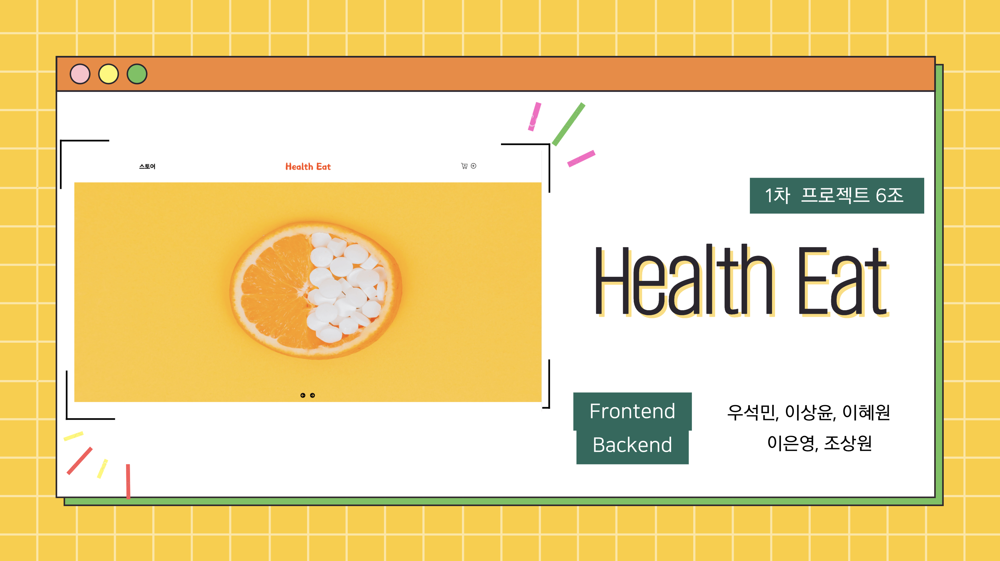

# 💊HealthEat
  
## (피리 마켓, 필리를 모델링 한 프로젝트)

### console.log("건강을 먹다")'

## Health Eat 팀원

- 프론트엔드

  - 우석민, 이상윤, 이혜원

- 백엔드

   - 이은영, 조상원(PM)
   
 

---

### 개발 인원 및 기간

- 개발 기간 : 2022/11/14 ~ 2022/11/25
- 개발 인원 : 프론트엔드 3명, 백엔드 2명

---

### 프로젝트 선정 이유

- 피리 마켓은 반려동물에 관한 물품이어서 팀원 모두가 관심을 가지고 있는 영양제라는 소재를 사용하기로 하였습니다. 그리고 이와 관련된 사이트를 살펴보던 중 '필리'라는 사이트도 참조 하였습니다.

 

## 적용 기술 및 구현 기능

### 적용 기술

> - <strong>프론트엔드</strong> : JavaScript(ES6), React.js, Sass, React-router-dom, Fontawesome
> - <strong>백엔드</strong> : JavaScript(ES6), Node.js, Express, JSON Web TOKEN, Bcrypt, My SQL, Multer
> - <strong>커뮤니케이션 및 버전 관리</strong> : Slack, Trello, Postman, Git / Github

 

구현 기능
 

1. 회원가입 / 로그인 페이지

   ✔ 토큰을 이용한 회원가입, 로그인 기능 
   ✔ 모두 동의하기 기능 구현 
    

2. 메인 페이지

   ✔ 화면 슬라이더 구현 
   ✔ 카테고리 리스트 구현 및  
   ✔ 리스트의 각 항목에 알맞은 제품을 표시할 수 있도록 스토어 페이지로 연결  
    

3. 제품 리스트

   ✔ fetch API를 활용한 렌더링 
   ✔ 쿼리스티링을 활용 
   ✔ 페이지네이션 구현
    
   
4. 상세 페이지

   ✔ 백엔드에서 제품의 상세 데이터를 받아 상품 디테일 페이지에 표시 
   ✔ 구매 수량에 맞춰 상품 가격 변경 

   

  - 이 프로젝트는 '피리 마켓', '필리' 사이트를 참조하여 만들었습니다.

  - 실무 수준의 프로젝트이지만 학습용으로 만들었기 때문에 이 코드를 활용하여 이득을 취하거나 무단 배포할 경우 법적으로 문제될 수 있습니다.

   
   

  HealthEat 프로젝트는 '피리 마켓', '필리'를 모델링 한 프로젝트이며, 백지 상태에서 구현되었습니다. 기획 의도를 현실로 바꾸는, 기획의 ‘구현’이라 생각합니다. 따라서, 기획 과정을 건너 뛰고 구현에 집중하기 위해 피리 마켓, 필리 라는 서비스를 참고한 것일 뿐, 프로젝트의 모든 기능은, 실제 서비스 개발과정과 마찬가지로, 백지 상태에서 구현되었음을 밝힙니다.
